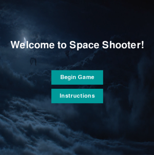
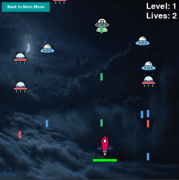

## Space Shooter

###### Created a Space shooter game in Pygame as a project for learning Python. This project is my first real implementation of OOP in Python.

Player can move using arrow keys and shoot lasers using space-bar.
 
Added a feature where each on-screen button changes colours when mouse cursor is on it.

## Menu Screen:

## Game Screen:

